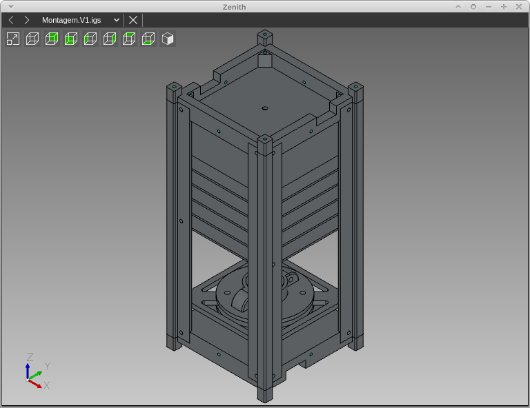

# IGSControler

Alteração do Mayo (Projeto teste)

## Passos
- Instalar o opencascade
- Executar o qmake passando os caminhos corretos:
qmake "CASCADE_INC_DIR=/usr/lib64/opencascade-7.3.0/include/opencascade" "CASCADE_LIB_DIR=/usr/lib64/opencascade-7.3.0/lib/"
- Executar o make

## Abrir Arquivo
mainWindow.openDocumentsFromList

## Rotacionar exibição
mainWindow.rotate(10,20,30);

